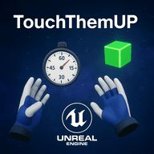
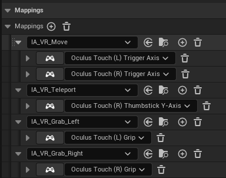

# TouchThemUp

📌 Descripción de la experiencia
TouchThemUp es una experiencia de realidad virtual desarrollada completamente desde cero en Unreal Engine 5 para Meta Quest 3. El objetivo es simple pero desafiante: recoger todos los objetos del entorno antes de que acabe el tiempo. Esta experiencia combina mecánicas físicas intuitivas, movimiento libre y una estética clara con feedback directo, enfocándose en la interacción física en VR y la agilidad espacial del jugador.

🕹️ Cómo jugar / Controles
Tienes que coger todos los cubos antes de que se acabe el tiempo

🎮 Esquema de controles

Los controles están distribuidos de la siguiente forma:

Locomoción libre: Joystick izquierdo o derecho (trigger axis)

Teletransporte: Thumbstick hacia adelante (eje Y positivo)

Agarrar objetos: Botón de grip izquierdo o derecho

Soltar objetos: Al soltar el botón de grip

Interacción física: Basada en colisiones reales con físicas activas

📄 Licencias
Todos los assets utilizados cumplen con licencias compatibles para uso académico .

Assets externos:

Materiales y props de Epic Games.

Modelos de mano y efecto de teletransporte:

Autor: Saied Baran

Licencia: CC0

Repositorio: GitHub

Recursos propios:
Lógica de movimiento, teletransporte y animaciones de manos

Sistema de agarre, físicas e interacción

UI 3D integrada con textos visibles en columna VR

Efectos visuales como desenfoque de profundidad al mirar lejos

Todo el código en C++ ha sido implementado desde cero

Audio:
Propio de Epic Games

🎤 Entrevista
🛠 Descripción del proceso de creación
El desarrollo partió de una idea clara: crear una experiencia completa sin usar plantillas prediseñadas. Todo se ha diseñado manualmente:

Sistema de interacción física en VR basado en colisiones y físicas reales

Lógica de temporizador, puntuación y reinicio en C++

UI 3D colocada en el entorno (no en pantalla), visible desde los 4 lados de una columna

Efectos visuales como desenfoque dinámico por distancia

Cada funcionalidad fue implementada y depurada directamente, mezclando Blueprints y C++ según las necesidades técnicas.

❗ Dificultades encontradas
Compilación y errores en C++: Sin usar plantillas, fue necesario compilar constantemente, resolver errores de símbolos externos, dependencias cruzadas, y redefinir clases para que Unreal las reconociera.

Interacción VR desde cero: Implementar el sistema de agarre y físicas sin apoyarse en plantillas de Unreal o plugins externos. Se diseñó un sistema modular de Interactables, Pickups y lógica de manos.

Movimiento cómodo en VR: Se integró locomoción libre con joystick junto al teletransporte opcional, permitiendo al jugador elegir.

Desenfoque por distancia (focus blur): Se programó un sistema visual para desenfocar la escena al mirar a lo lejos, aumentando la sensación de profundidad.

Optimización para Quest 3: Al tratarse de un dispositivo standalone, fue clave mantener un rendimiento alto mediante light baking, uso limitado de luces dinámicas y simplificación geométrica.

🔮 Siguientes pasos
Si se contara con más tiempo, se añadirían:

🏆 Tabla de puntuaciones online: para comparar tiempos entre jugadores

🧩 Modos de dificultad: con nuevos layouts, obstáculos o tiempo reducido

🎨 Efectos visuales pulidos: partículas, postprocesado personalizado y UI holográfica

